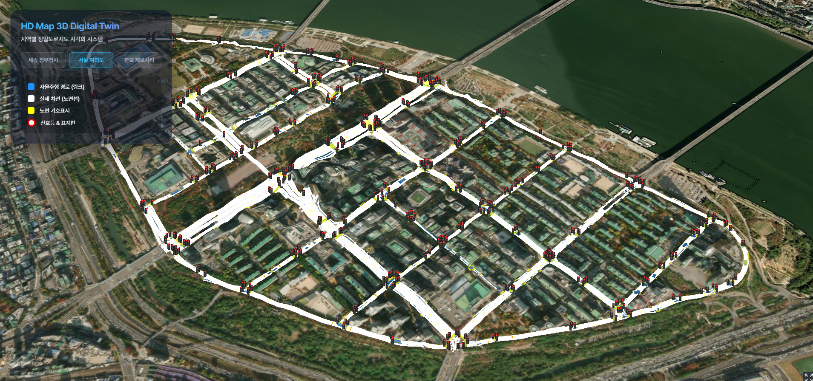
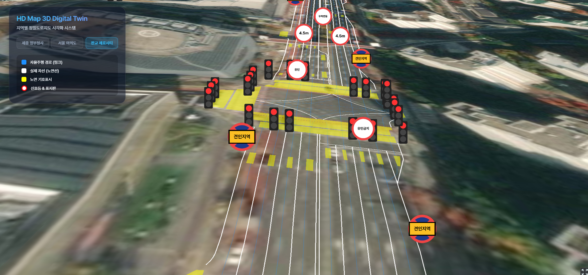

# HD Map 3D Digital Twin Viewer (CesiumJS)

정밀도로지도(HD Map)의 다양한 데이터(노면선, 안전표지, 신호등 등)를 3D 공간에 매핑하여 보여주는 쇼케이스입니다.

## 주요 기능
- **다중 지역 적용:** 세종, 여의도, 판교 등 여러 지역의 정밀도로지도를 전환하여 조회.
- **3D 지형 연동:** CesiumJS의 3D 타일 및 지형 데이터 위에 GeoJSON 벡터를 오버레이.
- **동적 표지판 렌더링:** `Remark` 속성을 파싱하여, 주정차금지, 견인지역, 높이제한 등 다양한 교통안전표지를 HTML5 Canvas 기반의 3D 빌보드로 실시간 렌더링.
- **자동 카메라 포커싱:** 지역 변경 시 해당 지역의 Bounding Box를 계산하여 부드럽게 카메라 이동 (FlyTo).

## 기술 스택
- **Core:** React 18, Vite
- **Mapping Engine:** CesiumJS
- **Data Format:** WGS84 좌표계로 변환된 GeoJSON

